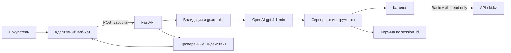

# EKT AI — ИИ-ассистент интернет-магазина электротоваров

> Чат-консультант для покупателей ekt.kz: находит товары в реальном каталоге, проверяет цену и остаток, предлагает аналоги и помогает собрать корзину.

**Ранее опубликованная демо-версия:** [ekt-ai-assistant-demo.vercel.app](https://ekt-ai-assistant-demo.vercel.app)

Версию запущенного кода и активный источник каталога можно проверить через [`/health`](https://ekt-ai-assistant-demo.vercel.app/health).

## Краткое описание

Покупателю электротоваров часто приходится вручную просматривать большой каталог, сопоставлять характеристики и уточнять наличие у менеджера. EKT AI переносит этот путь в один диалог.

Пользователь формулирует задачу обычным языком на русском или казахском, а ассистент загружает каталог напрямую из API ekt.kz, возвращает подтверждённые данные и помогает выбрать товар. Решение рассчитано на покупателей ekt.kz.

## Что реализовано

- поиск по названию, артикулу, категории и характеристикам товара;
- получение цены, остатка, характеристик, сертификатов и наличия по складам, если эти данные присутствуют в ответе EKT API;
- подбор доступных аналогов из той же категории;
- ответы по условиям оплаты, доставки и покупки;
- ответы на русском и казахском языках;
- безопасные интерактивные действия под ответом: характеристики, аналоги, наличие, сравнение и добавление в корзину;
- добавление товара только после явного подтверждения пользователя;
- изменение количества, удаление позиции и очистка корзины по явной команде;
- проверка количества и запрет добавления сверх текущего остатка;
- защита от повторного добавления при повторном или конкурентном запросе;
- блокировка платёжных данных, попыток раскрыть системный промпт и неподтверждённых товарных фактов;
- адаптивный интерфейс в стиле EKT для компьютеров и мобильных устройств;
- отдельная панель корзины и ссылка на `https://ekt.kz/cart`;
- health-check и автоматизированные unit/integration/adversarial-тесты.

## Как работает решение

1. Пользователь описывает нужный товар или задаёт вопрос в чате.
2. FastAPI валидирует запрос, ограничивает размер контекста и восстанавливает серверную историю анонимной сессии.
3. OpenAI-модель выбирает подходящий инструмент: поиск, карточку товара, аналоги, условия покупки или корзину.
4. Backend получает факты из API ekt.kz и передаёт модели только нормализованные данные каталога.
5. Перед отправкой ответ проходит дополнительные проверки: цена, остаток, артикул и характеристики должны подтверждаться результатами инструментов.
6. Backend проверяет и возвращает описания следующих действий, а frontend отображает их кнопками при наличии подтверждённого контекста. Подписи, артикулы и максимальное количество не принимаются на доверии от модели.
7. Корзина изменяется только после явной команды пользователя и повторной серверной проверки товара, количества и остатка.



## Технологии

| Область | Используется |
|---|---|
| Backend | Python 3.12, FastAPI, Pydantic, Uvicorn |
| AI | OpenAI Python SDK, Chat Completions, function calling, `gpt-4.1-mini` по умолчанию |
| Каталог | REST API ekt.kz, Basic Auth, `requests` |
| Frontend | HTML5, Vanilla JavaScript, Tailwind CSS CDN |
| Развёртывание | `render.yaml` для Python web service |
| Тестирование | `unittest`, FastAPI TestClient; в offline-тестах обращения к OpenAI и EKT API подменяются |

Pinecone и другие векторные базы не используются: товарные данные загружаются напрямую из реального API ekt.kz без отдельной векторной копии каталога.

## Архитектура проекта

```text
.
├── main.py                  # FastAPI, API-контракт, сессии и обработка ошибок
├── agent.py                 # AI-цикл, инструменты каталога и операции корзины
├── catalog.py               # загрузка, нормализация, поиск и детали товаров EKT
├── guardrails.py            # проверка фактов и защита ответов модели
├── ui_actions.py            # валидация и локализация интерактивных действий
├── logic/
│   ├── system_prompt.txt    # правила поведения ассистента
│   ├── purchase_conditions.txt
│   └── demo_questions.json  # контрольный пользовательский сценарий
├── static/                  # интерфейс чата и корзины
├── tests/                   # unit, integration и adversarial-тесты
├── requirements.txt
└── render.yaml
```

Основные HTTP-маршруты:

| Метод и путь | Назначение |
|---|---|
| `GET /` | веб-интерфейс |
| `GET /health` | состояние и источник каталога |
| `GET /api/demo-questions` | примеры вопросов по загруженному каталогу |
| `POST /api/chat` | диалог с ассистентом |

Базовый запрос к чату:

```json
{
  "session_id": "jury-session-1",
  "messages": [
    {"role": "user", "content": "Покажи кабель ВВГ 3х2.5"}
  ]
}
```

Ответ сохраняет базовые поля `reply`, `cart`, `cart_link` и дополнительно возвращает необязательный для клиента массив проверенных действий `actions`:

```json
{
  "reply": "...",
  "cart": [],
  "cart_link": "https://ekt.kz/cart",
  "actions": []
}
```

## Установка и запуск

### 1. Требования

- Python 3.12;
- ключ OpenAI API;
- выданные организаторами логин и пароль read-only API ekt.kz.

### 2. Клонирование и зависимости

```bash
git clone https://github.com/BAITC-Hacks/hack-21ad5124-flawless.git
cd hack-21ad5124-flawless
python -m venv .venv
```

Linux/macOS:

```bash
source .venv/bin/activate
pip install -r requirements.txt
```

Windows PowerShell:

```powershell
.\.venv\Scripts\Activate.ps1
python -m pip install -r requirements.txt
```

### 3. Переменные окружения

Обязательные для полного режима:

```env
DEMO_MODE=0
OPENAI_API_KEY=<ключ OpenAI>
EKT_API_USER=<логин API EKT>
EKT_API_PASSWORD=<пароль API EKT>
```

Дополнительно поддерживаются:

```env
CATALOG_PER_PAGE=1000
CATALOG_PAGES=0
CORS_ORIGINS=*
MODEL_NAME=gpt-4.1-mini
```

Проект не читает `.env` автоматически. Значения нужно задать в окружении процесса или в настройках платформы развёртывания.

#### Автономная проверка без внешних аккаунтов

Чтобы проверить интерфейс, корзину и защитные сценарии без ключей OpenAI/EKT, можно запустить детерминированный fallback с локальной фикстурой из 40 товаров:

```powershell
$env:DEMO_MODE="1"
Remove-Item Env:OPENAI_API_KEY -ErrorAction SilentlyContinue
uvicorn main:app --host 0.0.0.0 --port 8000
```

Linux/macOS:

```bash
DEMO_MODE=1 OPENAI_API_KEY="" uvicorn main:app --host 0.0.0.0 --port 8000
```

Этот режим нужен только для автономного smoke-check. Рабочая конфигурация в `render.yaml` использует `DEMO_MODE=0` и прямой API ekt.kz.

### 4. Запуск

```bash
uvicorn main:app --host 0.0.0.0 --port 8000
```

Откройте `http://127.0.0.1:8000`.

### 5. Тесты

```bash
python -m unittest discover -s tests -v
```

Автотесты не выполняют реальные запросы к OpenAI и ekt.kz.

## Как проверить решение

### Основной сценарий

1. Откройте `/health`. Для полного режима ожидаются `ok: true`, `catalog_source: "live"` и ненулевое число товаров.
2. Откройте главную страницу и нажмите **«Пример диалога»** — сервер сформирует вопросы по реально загруженному каталогу.
3. Запросите характеристики и наличие предложенного артикула.
4. Попросите подобрать аналог.
5. Спросите об условиях оплаты и доставки.
6. Выберите доступный товар и напишите: `Да, добавь 1 шт <артикул> в корзину` либо воспользуйтесь кнопкой **«Добавить»**.
7. Убедитесь, что позиция появилась в панели корзины, а количество не превышает остаток.
8. Измените количество или удалите товар через предложенное действие.

Дополнительные вопросы для свободной проверки:

```text
Покажи кабель ВВГ 3х2.5
Есть автомат ABB на 40 А?
Найди светильник мощностью 36 Вт
Какие способы оплаты и доставки доступны?
```

Результаты товарных запросов зависят от текущего содержимого API ekt.kz.

### Проверки ограничений

- вопрос о цене не должен менять корзину;
- запрос количества выше остатка должен быть отклонён;
- неизвестный артикул не должен получать выдуманные цену или характеристики;
- для пустого, слишком длинного или некорректного сообщения API возвращает контролируемый HTTP `422`, а не `500`;
- номера карт, CVV, SMS-коды и пароли не должны передаваться модели;
- просьба раскрыть системный промпт или выдать несуществующую скидку должна быть отклонена.

## Данные и интеграции

### API ekt.kz

Основной и единственный товарный источник в рабочем режиме:

- `GET https://ekt.kz/api/products` — список и пагинация товаров;
- `GET https://ekt.kz/api/products/detail?id=...` — подробная карточка товара.

Каталог загружается при запуске. Первая страница определяет объём пагинации, остальные страницы запрашиваются с ограниченным параллелизмом. Подробности подходящих товаров загружаются лениво и кэшируются в памяти.

### OpenAI API

Модель не получает прямого доступа к HTTP, корзине или пользовательской сессии. Она выбирает строго описанные серверные инструменты, а backend валидирует каждый вызов и его результат.

### Локальные данные

- `logic/system_prompt.txt` — правила агента и ограничения безопасности;
- `logic/purchase_conditions.txt` — текст условий покупки;
- `catalog_demo.json` сохранён как автономная тестовая фикстура и не загружается при `DEMO_MODE=0`.

Все ключи и пароли задаются через переменные окружения и не хранятся в репозитории.

## Ограничения текущей версии

- Корзина ассистента не синхронизируется с реальной корзиной ekt.kz: предоставленный API содержит только методы чтения каталога.
- Корзины и история диалога хранятся в памяти процесса и сбрасываются после перезапуска сервера; база данных отсутствует.
- Список каталога загружается при запуске процесса; изменения в EKT API гарантированно подхватываются после перезапуска сервиса.
- Пользовательская авторизация и оформление оплаты в чате не реализованы.
- Условия в `logic/purchase_conditions.txt` помечены как демонстрационные и требуют замены на официальные условия перед промышленным запуском.
- Для полного режима обязательны доступность EKT API и корректные ключи OpenAI/EKT.
- Tailwind CSS загружается через CDN.
- Для изображения реализован только локальный предпросмотр; отправка фото на backend, vision-анализ и загрузка PDF пока не реализованы.
- Прототип работает как отдельная веб-страница в стиле EKT и не встроен в production-сайт ekt.kz.

## Публичная версия

**Ранее опубликованная демо-версия:** https://ekt-ai-assistant-demo.vercel.app

Стенд может не соответствовать последнему commit ветки `main`. Его доступность и активный источник каталога проверяются по адресу:

**https://ekt-ai-assistant-demo.vercel.app/health**
